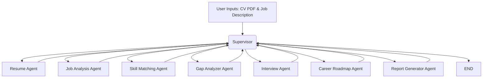

# CareerPilot AI 🚀

CareerPilot AI is an Agentic AI Career Assistant built with **LangGraph**. It analyzes a candidate's CV (PDF) and a target Job Description to provide a comprehensive, personalized career report. 

Unlike traditional semantic search or RAG-based systems, CareerPilot utilizes a multi-agent workflow where specialized AI agents sequentially process and enrich the data to provide deep insights, actionable recommendations, and a concrete learning roadmap.

---

## Features

- **Resume Parsing:** Extracts structured data (skills, experience, education, ML/AI focus) directly from a PDF.
- **Job Analysis:** Deconstructs job descriptions to identify required vs. preferred skills and key responsibilities.
- **Skill Matching:** Compares candidate skills with job requirements, outputting a calibrated 0–100 match score with a breakdown of matched, missing, and partial skills.
- **Gap Analysis:** Prioritizes missing skills (High, Medium, Low) and provides reasons for their importance, enriched with web search.
- **Interview Preparation:** Generates personalized Technical, Project, Behavioral, and HR questions based on the exact overlap (and gaps) between the CV and JD.
- **Career Roadmap:** Synthesizes gaps into actionable Immediate (0-2w), Short-term (1-3m), and Long-term (3-12m) milestones, suggesting specific projects and certifications.
- **Final Report Generation:** Compiles all agent outputs into a beautiful, human-readable markdown report with an executive summary and final hiring probability assessment.

---

## Architecture Diagram



### Tech Stack
- **AI/Orchestration:** LangGraph, LangChain, Pydantic (Structured Outputs)
- **Backend:** FastAPI, PyMuPDF (PDF Extraction), Uvicorn
- **Frontend:** React, Vite, Vanilla CSS (Glassmorphism & Gradients)
- **Deployment:** Docker, Docker Compose

---

## Project Structure

```
careerpilot-ai/
│
├── backend/                  # FastAPI & LangGraph backend
│   ├── agents/               # Individual LangGraph node functions
│   ├── api/                  # FastAPI routes
│   ├── graph/                # State definitions and router
│   ├── schemas/              # Pydantic models for structured output
│   ├── services/             # Orchestration service
│   ├── tools/                # PDF parsing, web search, file saving
│   ├── config.py             # Env config loader
│   ├── llm.py                # LLM factory
│   └── main.py               # FastAPI entry point
│
├── frontend/                 # React + Vite application
│   ├── public/
│   └── src/
│       ├── components/       # UI Cards (Score, Gap, Roadmap, etc.)
│       ├── hooks/            # Custom React hooks (useFileUpload)
│       ├── App.jsx           # Main React component
│       ├── api.js            # API client
│       ├── index.css         # CSS Design system
│       └── main.jsx          # React entry point
│
├── tests/                    # Pytest test suite
│
├── data/                     # Output directory for saved reports & JSONs
├── .env.example              # Environment variables template
├── docker-compose.yml        # Docker composition
├── Dockerfile.backend        # Backend image definition
├── Dockerfile.frontend       # Frontend image definition
├── requirements.txt          # Python dependencies
└── README.md                 # You are here
```

---

## Installation & Setup

### Prerequisites
- Python 3.10+ (if running locally)
- Node.js 20+ (if running locally)
- Docker & Docker Compose (if running via Docker)
- An OpenAI API Key (or Google/Anthropic, configurable)

### Environment Variables
Copy `.env.example` to `.env` in the root directory:
```bash
cp .env.example .env
```
Open `.env` and fill in your API keys (e.g., `OPENAI_API_KEY`). You can optionally configure `TAVILY_API_KEY` for enhanced web search.

---

## How to Run

### Option 1: Docker (Recommended)
You can spin up both the frontend and backend using Docker Compose:
```bash
docker compose up --build
```
- Frontend will be available at: `http://localhost:80` (or `http://localhost` depending on your OS)
- Backend API will be at: `http://localhost:8000/api`
- API Docs: `http://localhost:8000/docs`

### Option 2: Local Development
**1. Start the Backend:**
```bash
# Create a virtual environment
python -m venv venv
# Activate it (Windows)
venv\Scripts\activate
# Activate it (Mac/Linux)
source venv/bin/activate

# Install dependencies
pip install -r requirements.txt

# Run the FastAPI server
cd backend
python main.py
# Server runs on http://localhost:8000
```

**2. Start the Frontend:**
```bash
# Open a new terminal
cd frontend
npm install
npm run dev
# Frontend runs on http://localhost:5173
```

---

## API Usage

The main endpoint is `POST /api/analyze`. It expects a `multipart/form-data` payload containing:
- `cv_file`: The PDF file (max 10MB)
- `job_description`: Text string (min 50 characters)

Example using `curl`:
```bash
curl -X POST "http://localhost:8000/api/analyze" \
  -H "accept: application/json" \
  -H "Content-Type: multipart/form-data" \
  -F "cv_file=@/path/to/your/resume.pdf" \
  -F "job_description=Senior Machine Learning Engineer requirements..."
```

---

## Testing & Evaluation

Tests cover Pydantic schemas, agent logic (with mocked LLMs), FastAPI endpoints, and LangGraph routing.

Run the test suite from the root folder:
```bash
pytest tests/
```

We also included an evaluation file (`tests/evaluation.py`) with sample CVs and JDs to test matching bounds and logic.

---

## Future Improvements

- Add OAuth/Auth0 for user authentication to store personal roadmaps.
- Implement streaming for the frontend so users can read the report as it is being generated.
- Add real-time web socket updates for agent progress instead of polling/timers.
- Integrate memory into the graph for multi-turn interview simulations (Grill-Me feature).
